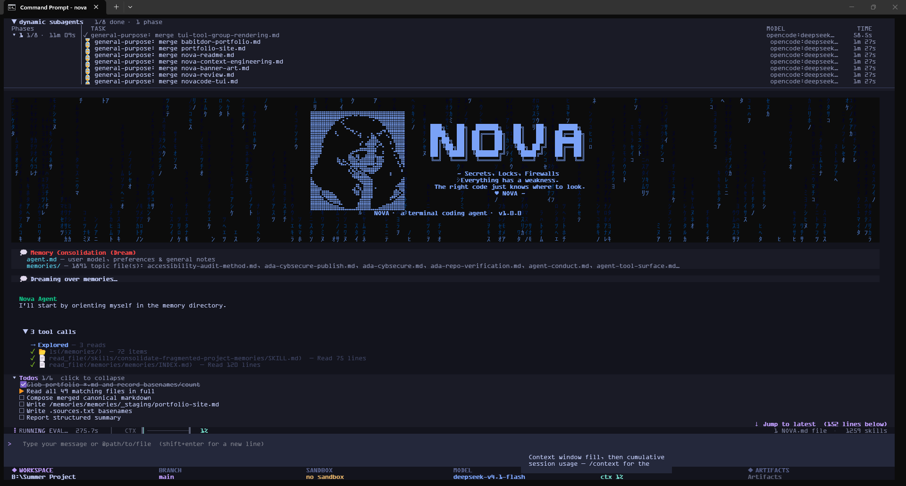

# NOVA : Agentic Coding Tool

[](https://github.com/Babitdor/NovaCode)
[](https://opensource.org/licenses/MIT)
[](https://www.python.org/)

An open-source, terminal-based AI coding assistant built on LangGraph and the `deepagents` framework. NOVA runs entirely in your terminal with a Textual TUI, a headless non-interactive mode for scripting and CI, and remote bridges for Discord/Telegram — similar to Claude Code, but extensible and transparent.



## Features

### Core Intelligence
- **LangGraph Agent Loop**: Deep agent architecture with planning, subagents, filesystem access, and tool-calling — all orchestrated through a shared async event loop
- **Multi-Provider LLM Support**: OpenAI, Anthropic, Google Gemini, NVIDIA, OpenRouter, OpenCode, and local Ollama — configure any provider via environment variables, the OS keychain, or the onboarding wizard, and switch with `/model`. Thinking models round-trip their `reasoning_content`, so multi-turn tool use works on providers that require it
- **Autonomous Learning System (Hermes)**: Periodically reviews tool usage patterns, extracts lessons, and autonomously creates reusable skills — the agent improves itself over time without user intervention
- **Memory System**: Two-tier persistent memory — auto-maintained markdown files (`USER.md`/`MEMORY.md`) plus a LangGraph key/value store (`remember`/`recall`) for cross-session facts
- **Context Management**: A three-stage pipeline sized to the model's actual context window — older tool results are cleared first (and offloaded to `/cleared/` so the agent can read them back instead of losing them), then the conversation is compacted hierarchically, with a hard backstop that always keeps an 8k-token reserve. The pre-compaction transcript is archived to `~/.nova/sessions/<thread>/`, and the context meter survives `/resume`
- **System One Compaction (experimental)**: Instead of clearing tool results by age alone, Nova can ask a small local decision model — Tev1 (`tev1:4b`) on Ollama's `/v1/systemone` endpoint — whether each old tool result is still needed, and clear only the ones it scores stale. Cleared results are still offloaded to `/cleared/`, so nothing is lost. Off by default; see [System One Compaction](#system-one-compaction)
- **Native Vision**: A multimodal main model sees pasted images directly; a text-only one gets them captioned by an auxiliary vision model. Capability is detected from the model profile and can be overridden with `/vision`
- **Council Planning**: `/council <task>` has several agents propose plans independently, critique each other anonymously, and vote; a judge picks the top 3 and nothing is implemented until you approve one
- **Research Swarm**: `/research` fans a question out to 7 research personas (web researcher, fact checker, literature reviewer, market analyst, financial analyst, technical researcher, synthesizer) and merges their findings
- **Plan Mode with Stored Plans**: Read-only investigation, then a plan you approve. A plan you approve is saved to the project's `.nova/plans/`; a plan Nova approves on its own (auto-approve) goes to the global `~/.nova/plans/<project>/` archive
- **Steering Instructions**: Persistent user-defined directives injected into every model call — set once, always respected
- **Inline Verification Loop**: After each task, an out-of-band LLM call grades the output against a rubric — on a failing verdict, the agent is automatically re-driven with feedback (up to 3 retries). Fail-open by design
- **Prompt-Template Hill Climbing**: When reviews repeatedly flag the same class of misunderstanding, the system proposes a targeted rewrite of the relevant `.jinja` template, A/B tests it against the current version using verifier pass/fail as the quality signal, and promotes or discards it. Packaged templates are never modified — all overrides live in `~/.nova/prompt_history/`
- **Threshold Auto-Tuner**: Reads the durable trace data Hermes already records and nudges review-trigger thresholds toward the observed working style — more real work ⇒ review sooner; more browsing ⇒ review less. Damped convergence with hard floor/ceiling bounds
- **Cron / Heartbeat Scheduler**: Proactive scheduled tasks via standard 5-field cron expressions — fired jobs go on the same queue as remote bridges, so they run like any prompt. Manage with `/cron`
- **Webhook Ingress Server**: Let external systems (GitHub, Linear, or any signed sender) trigger a Nova run without a human relaying through Discord/Telegram. Per-source HMAC-SHA256 secrets, timing-safe verification, binds to `127.0.0.1` by default. Manage with `/webhook`
- **Reasoning Effort Control**: Dynamically adjust LLM reasoning effort (`/effort low|medium|high|off`) — hot-swaps the model without restarting. Supports OpenAI o-series, Gemini 2.5/3, and Claude 3.7 Sonnet
- **Self-Evolution Log**: Track the agent's own growth over time (`/evolution`) — skills unlocked and levelled up at the completion of complex tasks, persisted in durable store
- **Autonomous Goal Mode**: Set a persistent goal (`/goal <text>`) that is injected into every turn, with an optional acceptance rubric (`/goal rubric <criteria>`) graded by deepagents' `RubricMiddleware`. The agent runs autonomously toward the goal (capped at 5 turns by default) and stops when it declares `GOAL ACHIEVED`
- **Side Questions**: Ask a question on an ephemeral thread without touching the main conversation (`/btw <question>`)
- **Refinement Loop**: `/refine` runs a refinement audit trail over the session's work, with `history` and `rollback <id>` subcommands
- **Headless Mode**: Run a single prompt non-interactively and exit (`nova -p "..."`, or pipe the prompt on stdin) with `text`, `json`, or `stream-json` output — built for scripting and CI. `--max-turns` caps the run; `--deny-tools` auto-rejects tool approvals (fail-closed)

### UI & Interaction
- **Textual TUI**: Modern terminal UI with chat messages, modals, animations, keyboard shortcuts, condensed tool groups, and click-to-copy
- **Built to Stay Smooth**: Status ticks repaint in place instead of reflowing the screen, rendered Markdown is cached per width, static data stays out of checkpoints, subagent graphs compile on first use, the skill listing is cached across restarts, and garbage collection is tuned to run while you are idle. A watchdog logs any UI freeze over 1s to `~/.nova/logs/freeze.log`
- **Multi-line Prompt**: The input grows with its content; `shift+enter` inserts a newline
- **Parallel Session Panes**: Run several sessions side by side (`/session new`, `ctrl+n`, `alt+<n>`) and switch between them
- **Docked Todo Checklist**: The todo list stays on screen and can be clicked to collapse/expand
- **Condensed Tool UI**: Consecutive tool calls grouped into collapsible sections — full diffs shown for code edits; reads, searches, and other calls stay compact
- **Syntax-Highlighted Diffs**: Diff previews are syntax-highlighted per line (Pygments, keyed off the file extension) — token colours overlay the `+`/`-` marker colour, so added/removed lines stay visually distinct
- **Modal Animations**: Entrance effects (fade/slide/zoom) for all modal dialogs, pulsing borders, and a shimmer status bar
- **Web Chat UI**: Launch a local browser-based chat interface via `/chat` — dark-themed, Claude-inspired, with Markdown rendering and code highlighting
- **Nova Cowork Desktop App**: Launch a desktop companion app via `/cowork` (alias `/desktop`) for a native window onto the same agent
- **Local Voice I/O** (optional): Speak prompts and hear Nova's prose replies, fully offline — Faster-Whisper (STT), Silero VAD (utterance endpointing), and Piper (TTS). Push-to-talk (`ctrl+g`) or hands-free always-listening (`ctrl+l`); code blocks are stripped before speaking. One-command install: `uv tool install -e .[voice]`, or `uv pip install -e '.[voice]'` for uv run; manage with `/voice`. Swappable TTS/STT providers: cloud (ElevenLabs / Deepgram), **Orpheus** — an optional, very natural LLM-based local TTS (`/voice settings tts orpheus`; `uv pip install -e '.[voice-orpheus]'` + the CPU `llama-cpp-python` wheel; ~2GB model, slower than Piper), **Parakeet** — NVIDIA's local STT via sherpa-onnx (`/voice settings stt parakeet`; `uv pip install -e '.[voice-parakeet]'`), or **Pocket TTS** — Kyutai's lightweight local TTS (`/voice settings tts pocket`; `uv pip install -e '.[voice-pocket]'`)

### Tools & Capabilities
- **50+ Built-in Tools**: File operations, shell commands, web search (Tavily + DuckDuckGo), docs search, HTTP fetch, subagent delegation, semantic code search, project graph queries, wiki management, plan mode, artifacts, background tasks, daemons, a persistent Python kernel, and more. Rarely used tools are deferred behind `tool_search`, so they cost no context until needed
- **Artifacts**: Create, update, and list durable artifacts (`create_artifact`, `update_artifact`, `list_artifacts`) that persist across resume — browse them with `/artifacts`
- **Background Tasks**: Long-running shell jobs are monitored and reported back when they finish; inspect them with `list_background_tasks`, `get_task_status`, `get_task_logs`, `terminate_task`, `restart_task`, or the `/tasks` panel
- **Daemons**: Start, stop, and tail long-lived background processes (`daemon`) — dev servers, watchers, and the like
- **Persistent Python Kernel**: Run Python in a long-lived kernel that keeps state between calls (`python_kernel`)
- **Multi-Model Oracle**: Ask several models the same question and have a judge synthesize the best answer (`oracle`)
- **Web Scraping**: GitHub trending repos, Hacker News headlines, LinkedIn jobs, Reddit posts — no external API keys required
- **Semantic Code Search**: Find code by description or meaning, not just exact text matches (`code_search`, `find_related_code`)
- **LSP Integration**: Language Server Protocol support for go-to-definition, find references, rename, diagnostics, and more
- **Project Graph**: Visualize and query your codebase architecture — 5000+ nodes, community detection, dependency analysis, blast radius tracking

### Extensibility
- **MCP Support**: Extend capabilities with Model Context Protocol servers (12 presets, plus any custom server) — tools eagerly discovered with server-prefixed names to avoid collisions
- **Skills System**: 50+ built-in skills with progressive disclosure — domain-specific workflows loaded on demand. Install skills from any public GitHub repo
- **Plugin System**: Python entry-point based plugins that can register slash commands, add middleware at defined slots, and extend the agent
- **Custom Subagents**: 4 built-in in-process specialists (code exploration, refactoring, bug fixing, browser automation), plus the 7 research-swarm personas and any agents you define yourself. Longer, self-contained jobs go to the async agents below
- **Async Subagents**: 9 background agents on a LangGraph server that Nova launches itself, on demand, in your project directory (no Docker needed) — documentation updates, code reviews, test generation, dependency audits, refactoring, plan scouting, security audits, test runs, web research; results are automatically reported when the agent is idle. Without a usable server Nova falls back to the in-process subagents
- **Wiki System**: Persistent project wiki at `.nova/wiki/` — ingest web clippings (`/ingest`), ask questions with wiki context (`/ask`), file conversation knowledge as wiki pages (`/file`), and browse the vault (`/wiki`)

### Sandbox & Safety
- **Sandbox Execution**: Run code safely in sandboxes — OS (workspace-confined), Docker, Modal, Runloop, Daytona, LangSmith (hardware-virtualized microVMs)
- **Security-First**: Automatic `.gitignore` enforcement, command injection detection, URL sanitization, and input validation
- **File Recovery**: Automatic snapshots before destructive operations — restore deleted or overwritten files via `/restore` or agent tools (`list_trash`, `restore_file`)
- **Human-in-the-Loop (HITL)**: Configurable interrupt system requiring user approval before destructive or external operations
- **Path Approval**: Path-based operation approval for filesystem access outside the project root

### Infrastructure
- **Session Management**: Save, restore, auto-save, and resume sessions. Compact conversation history via `/compact`. Run several sessions in parallel panes (`/session new`) and resume a saved session for the current path with `/resume <id>`
- **Remote Bridges**: Discord and Telegram integration for remote agent interaction. Telegram accepts **voice notes** — they're transcribed with your configured `/voice` STT provider and sent to the agent as an ordinary prompt (the transcript is echoed back so you can see what was heard). In a Telegram forum each session gets its own topic, and a question Nova asks you is deleted from the chat once you answer it
- **Vixie Desktop Companion**: Background server for desktop notifications and system tray integration
- **Hooks System**: Lifecycle hooks at key points (pre/post tool call, on message, on error) — shell commands or Python scripts
- **Process Manager**: Subprocess lifecycle, health checks, and cleanup for dev servers and background tasks
- **LangSmith Tracing**: Built-in LangSmith integration for debugging, monitoring, and evaluating agent runs
- **Doctor Command**: System diagnostics to verify your environment, API keys, and dependencies
- **Onboarding System**: First-run setup that checks what you enter before saving it: an API key is tested against the provider and an Ollama host must answer with a model installed, so a typo shows up on the setup screen, not on your first prompt. Keys go to the OS keychain
- **Configuration Migration**: Migrate from legacy directory structure to Claude Code-compatible layout

## Quick Start (Two Commands)

```bash
git clone https://github.com/Babitdor/NovaCode.git
cd NovaCode
uv sync
```

**Run it:**
```bash
uv run nova
```

**Headless (non-interactive) — for scripting and CI:**
```bash
# Run a single prompt and exit
uv run nova -p "summarize the changes in this repo"

# Machine-readable output, capped at 10 turns, no tool approvals
uv run nova -p "run the test suite and report failures" --output-format json --max-turns 10 --deny-tools

# Or pipe the prompt on stdin
echo "explain src/main.py" | uv run nova -p
```

**Optional — voice I/O adds STT, TTS, and VAD (~2 GB extra):**
```bash
uv run nova
/voice test     # verify it works
ctrl+g          # push-to-talk
```

No need to install anything globally. `uv run nova` always runs the latest code from the repo — no stale snapshots, no PATH issues, no "which Python".

If you want a global `nova` command that works from any directory, add the repo's `.venv` to your PATH:
```bash
# Windows PowerShell:
$env:Path += ";$pwd\.venv\Scripts"
# Or add `B:\Summer Project 2026\Nova-Code\nova-code-cli\.venv\Scripts` to your system PATH
```
Then just type `nova` anywhere.

#### Alternative: Install with pip

```bash
# 1. Clone the repository
git clone https://github.com/Babitdor/NovaCode.git
cd NovaCode

# 2. Create a virtual environment
python -m venv .venv

# 3. Activate the virtual environment
# On Windows (PowerShell):
.venv\Scripts\Activate.ps1
# On Windows (Command Prompt):
.venv\Scripts\activate.bat
# On macOS/Linux:
source .venv/bin/activate

# 4. Upgrade pip
pip install --upgrade pip

# 5. Install dependencies
pip install -e .
```

### Verify Installation

```bash
# Check if nova is installed
nova --version

# Run system diagnostics
nova doctor

# Start the CLI
nova
```

### API Keys Setup

Configure your preferred LLM provider by setting environment variables:

#### Option 1: Environment Variables (Recommended)

```bash
# OpenAI (default)
export OPENAI_API_KEY="your-openai-api-key"

# Or Anthropic
export ANTHROPIC_API_KEY="your-anthropic-api-key"

# Or Google Gemini / NVIDIA / OpenRouter
export GOOGLE_API_KEY="your-google-api-key"
export NVIDIA_API_KEY="your-nvidia-api-key"
export OPENROUTER_API_KEY="your-openrouter-api-key"

# Optional: Web search (Tavily)
export TAVILY_API_KEY="your-tavily-api-key"
```

#### Option 2: .env File

Create a `.env` file in your project root or home directory:

```bash
# .env file
OPENAI_API_KEY=your-openai-api-key
ANTHROPIC_API_KEY=your-anthropic-api-key
TAVILY_API_KEY=your-tavily-api-key
```

#### Option 3: Configuration File (Secure Keychain)

```bash
# Store keys securely via OS keychain
nova secrets set openai_api_key
nova secrets set anthropic_api_key
```

### Troubleshooting

| Issue | Solution |
|-------|----------|
| **Python version mismatch** | `python --version` → specify version: `uv venv --python 3.11` |
| **Virtual env not activating (Windows)** | `Set-ExecutionPolicy -ExecutionPolicy RemoteSigned -Scope CurrentUser` then retry |
| **Package installation fails** | `uv cache clean && uv sync --reinstall` |
| **Missing dependencies** | `uv sync --all-extras` |
| **Import errors** | `uv pip install -e . --force-reinstall` |

### Development Setup

```bash
# Install development dependencies
uv sync --all-extras

# Run tests
pytest tests/

# Format and lint code
make format
make lint

# Type checking
mypy novacode_cli/
```

## CLI Reference

### Top-Level Subcommands

| Command | Description |
|---------|-------------|
| `nova init` | Initialize project or global configuration |
| `nova list` | List all available agents |
| `nova help` | Show help information |
| `nova reset --agent <name>` | Reset an agent's memory/store |
| `nova skills` | Manage agent skills (list, create, add, remove, find, update) |
| `nova mcp` | Manage MCP servers (add, remove, list, install) |
| `nova config` | View or edit configuration (show, set, get) |
| `nova secrets` | Manage API keys securely (set, list, delete) |
| `nova doctor` | Validate configuration and connections |
| `nova paths` | Manage approved file system paths (list, revoke, clear) |
| `nova migrate` | Migrate to new directory structure |

### Flags

| Flag | Default | Description |
|------|---------|-------------|
| `--agent` | `"nova-agent"` | Agent identifier for separate memory stores |
| `--auto-approve` | off | Auto-approve tool usage (disables HITL) |
| `--sandbox` | `os` (Linux/macOS), `none` (Windows) | Sandbox provider: `none`, `os`, `modal`, `daytona`, `runloop`, `docker`, `langsmith` |
| `--no-sandbox` | off | Run shell commands unconfined on the host (disables OS/Docker sandbox) |
| `--sandbox-id` | `None` | Reuse an existing sandbox (skips create/cleanup) |
| `--sandbox-setup` | `None` | Path to setup script to run in sandbox after creation |
| `--sandbox-vcpus` | `None` | Number of virtual CPUs (LangSmith sandbox only) |
| `--sandbox-mem-bytes` | `None` | Memory in bytes (LangSmith sandbox only, e.g. 8589934592 for 8GB) |
| `--sandbox-fs-capacity-bytes` | `None` | Filesystem capacity in bytes (LangSmith sandbox only) |
| `--sandbox-snapshot` | `None` | Snapshot name to boot from (LangSmith only) |
| `--sandbox-snapshot-id` | `None` | Snapshot ID to boot from (LangSmith only) |
| `--ports` | `None` | Port forwarding for Docker sandbox (format: `PORT` or `HOST:CONTAINER`, comma-separated) |
| `--no-splash` | off | Disable the startup splash screen |
| `--continue` / `-c` | off | Continue last session (optionally specify session ID) |
| `--resume` / `-r` | off | Interactively select and resume a session |
| `--print` / `-p` | off | Run a single prompt non-interactively and exit (pass the prompt as the value, or omit it to read from stdin) |
| `--output-format` | `text` | Headless output format: `text`, `json`, or `stream-json` |
| `--max-turns` | `None` | Headless only: cap the number of agent turns |
| `--deny-tools` | off | Headless only: auto-reject tool approvals (fail-closed) instead of prompting |
| `--version` | — | Show version number and exit |

### Interactive Slash Commands

| Command | Description |
|---------|-------------|
| `/help` | Show interactive help |
| `/exit` / `/quit` / `/q` | Exit the CLI |
| `/clear` | Clear conversation history and reset session |
| `/tokens` | Display token usage for the session |
| `/context` | Display current context window status |
| `/cost` | Show session token spend |
| `/verbose` | Toggle verbose mode (show internal agent context) |
| `/steer` | Set persistent steering instructions for the agent |
| `/goal` | Set a persistent goal injected into every turn (`/goal rubric <criteria>` for an acceptance rubric; `status` / `clear`) |
| `/btw` | Ask a side question on an ephemeral thread without touching the main conversation |
| `/save` | Save current session |
| `/compact` | Compact conversation history with optional focus |
| `/sessions` | List, select, or delete saved sessions |
| `/session` | Parallel sessions: `new` / `list` / `close` (`ctrl+n`, `alt+<n>`) |
| `/resume` | Resume a saved session for this path (`/resume <id>`) |
| `/restore` | Restore a previous file version from snapshots |
| `/files` | Show file operation summary for the session |
| `/images` | Manage tracked image references |
| `/artifacts` | Open the artifacts list |
| `/tasks` | Open the background tasks panel |
| `/log` | Show workspace log files |
| `/servers` | Show active server processes |
| `/tests` | Run test suites |
| `/kill` | Kill a process by PID |
| `/notifications` | Review and manage notifications |
| `/remote` | Manage remote sandbox connections |
| `/reindex` | Rebuild semantic code search index |
| `/copy` | Copy the last response (or the whole chat) |
| `/theme` | Switch color theme |

| Command | Description |
|---------|-------------|
| `/init` | Generate/update project documentation and graph |
| `/mcp` | Interactive MCP server management menu |
| `/model` | Switch the model for the main agent, the subagents, the async agents or the dynamic agents |
| `/hooks` | Manage lifecycle hooks (list, add, remove, enable, disable) |
| `/skills` | Interactive skills manager |
| `/agents` | Custom agent management (view, create, delete) |
| `/plugins` / `/plugin` | Nova plugin management (list, enable, disable) |
| `/middleware` | List active middleware (`/reload-plugins` to reload) |
| `/reload-plugins` | Reload plugin registrations |
| `/plan` | Invoke plan-mode agent for investigation & approval (approved plans are saved to `.nova/plans/`) |
| `/agent-server` | Control the local LangGraph server for async agents — `status`, `start`, `stop`, `restart`, `logs` |
| `/trace` | LangSmith tracing management (status, enable, projects) |
| `/ralph` | Autonomous looping mode (background task execution) |
| `/council <task>` | Plan a task with the council: agents propose independently, critique anonymously, vote, and a judge picks the top 3 for you to approve |
| `/council view [n]` | Show the selected plans, or plan `n` in full |
| `/council approve <n>` | Approve plan `n` and hand it to the coding agent (nothing is implemented before this) |
| `/council revise <notes>` | Re-plan with your changes |
| `/council history` | Past council runs (kept in `.nova/council/`) |
| `/chat` | Launch local browser-based chat UI |
| `/cowork` / `/desktop` | Launch the Nova Cowork desktop app (`/cowork [task]`) |
| `/trello` | Browser-based task board server |
| `/research` | Multi-agent research swarm (academic/market/stocks/technical/general) |
| `/dream` | Run memory consolidation |
| `/browser-use` | AI-powered browser automation |
| `/create` | Launch the Skills & Agents web UI for browsing, editing, and creating skills/agents |
| `/skill:<name>` | Directly invoke a skill by name (e.g., `/skill:api-testing`) |
| `/cron` | Manage scheduled (heartbeat) tasks — list, add, remove, fire now |
| `/webhook` | Manage webhook ingress server — start, stop, register sources, status |
| `/prompt` | Manage evolving system-prompt templates — status, rollback, accept, reject |
| `/refine` | Refinement audit trail (`/refine history`, `/refine rollback <id>`) |
| `/voice` | Local voice I/O — status, on/off, mode ptt\|listen, test (ctrl+g talk, ctrl+l listen) |
| `/effort` | Set reasoning effort level — `low`, `medium`, `high`, or `off` (hot-swaps model) |
| `/vision` | Configure image handling — status, set the auxiliary vision model, or force the main model multimodal/text-only |
| `/evolution` | View the self-evolution log — skills unlocked (🧬) and levelled up (⬆️) |
| `/learning` | Toggle Nova's autonomous learning loop (`/learning on\|off\|status`) |
| `/ingest` | Ingest captured sources (Obsidian Web Clipper) into synthesized wiki pages |
| `/ask` | Ask a question informed by wiki context — searches wiki and answers with relevant knowledge |
| `/file` | File recent conversation knowledge as a wiki page under a topic path |
| `/wiki` | List all synthesized pages in the project wiki vault |

## Built-in Tools

| Tool | Description |
|------|-------------|
| `ls` | List files and directories |
| `read_file` | Read contents of a file |
| `write_file` | Create or overwrite a file |
| `edit_file` | Make targeted edits to existing files |
| `glob` | Find files matching a pattern (e.g., `**/*.py`) |
| `grep` | Search for text patterns across files |
| `shell` | Execute shell commands (local mode) |
| `execute` | Execute commands in remote sandbox (sandbox mode) |
| `task` | Delegate work to subagents for parallel execution |
| `write_todos` | Create and manage task lists for complex work |
| `think` | Structured reasoning and reflection before acting |
| `web_search` | Search the web using Tavily API |
| `duckduckgo_search` | Web search using DuckDuckGo (no API key required) |
| `docs_search` | Search official documentation sites |
| `fetch_url` | Fetch and convert web pages to markdown (covers all HTTP methods) |
| `github_trending` | Scrape GitHub trending repositories by language/time range |
| `hacker_news` | Scrape Hacker News front page headlines |
| `linkedin_jobs` | Search LinkedIn job listings (Playwright-based, no login) |
| `reddit_posts` | Scrape Reddit posts by subreddit, user, or search query |
| `package_info` | Get package version and dependency info (PyPI / npm) |
| `read_memory` / `write_memory` | Read and write persistent markdown agent memories |
| `remember` / `recall` | Store and fetch durable cross-session facts by key |
| `list_memories` / `forget` | List and delete stored durable memory facts |
| `list_trash` | List file snapshots available for recovery |
| `restore_file` | Restore a deleted or overwritten file from snapshots |
| `create_artifact` | Create a durable artifact (markdown, code, etc.) that persists across resume |
| `update_artifact` | Update an existing artifact's title, type, or content |
| `list_artifacts` | List all artifacts in the session |
| `list_background_tasks` | List agent-launched background shell jobs |
| `get_task_status` | Get a background task's status, runtime, and exit code |
| `get_task_logs` | Read the recent output of a background task |
| `terminate_task` | Stop a running background task |
| `restart_task` | Restart a background task |
| `daemon` | Start, stop, and tail long-lived background processes |
| `python_kernel` | Run Python in a persistent kernel that keeps state between calls |
| `oracle` | Ask several models the same question and have a judge synthesize the answer |
| `query_project_graph` | Query the project graph for architectural information |
| `code_search` | Semantic code search by description or symbol name |
| `find_related_code` | Find code semantically similar to a known location |
| `start_async_task` | Start a background task on a remote LangGraph server |
| `check_async_task` | Check status and result of a background task |
| `update_async_task` | Send updated instructions to a running background task |
| `cancel_async_task` | Cancel a running background task |
| `list_async_tasks` | List all tracked background tasks |
| `speak` | Speak a short summary aloud via TTS |
| `skill_manage` | Create, refine, or remove reusable skills |
| `wiki_read` | Read a wiki page by path |
| `wiki_search` | Search the project wiki for pages matching a query |
| `wiki_update_index` | Add or update an entry in the wiki index |
| `wiki_write` | Write or overwrite a wiki page |
| `enter_plan_mode` | Switch to read-only investigation mode before coding |
| `exit_plan_mode` | Present a plan for user approval and exit plan mode |
| `ask_user_question` | Ask the user a multiple-choice question and wait for response |

> **Note**: Potentially destructive operations require user approval. Use `--auto-approve` to skip prompts.

## Trello Task Board

NOVA includes a browser-based task board for managing and processing tasks visually. Start it with `/trello`.

```
/trello              Start the task board server and open browser
/trello stop         Stop the task board server
/trello status       Show current task board state
```

### Task Lifecycle

| Status | Description |
|--------|-------------|
| **Loaded** | Task added, waiting to be processed |
| **Processing** | Agent is currently working on the task |
| **Done** | Task completed by the agent |

## Web Chat UI

Launch a local browser-based chat interface with `/chat`:

```
/chat              Start the chat server and open browser
/chat stop         Stop the chat server
/chat status       Show chat server status
```

- **Dark-themed UI**: Claude-inspired design with red accents
- **Markdown Rendering**: Full Markdown + syntax highlighting via `marked` + `highlight.js`
- **Typing Indicator**: Animated bouncing dots while the agent responds
- **Same Agent**: Connects to the same LangGraph agent — no separate config

## Web Scraping Tools

Built-in tools that work with public data — no API keys required:

| Tool | Data Source |
|------|-------------|
| `github_trending` | GitHub trending repositories |
| `hacker_news` | Hacker News front page |
| `linkedin_jobs` | LinkedIn job listings (Playwright) |
| `reddit_posts` | Reddit posts by subreddit/user/search |

Standalone CLI scripts also available in `scripts/scraper/`.

## Autonomous Learning System (Hermes)

NOVA includes **Hermes**, an autonomous learning system that runs in the background:

- **Self-Review**: Every ~10 tool calls, Hermes reviews tool usage patterns and extracts lessons
- **Self-Improving Memory**: Automatically maintains two memory tiers:
  - `USER.md` — User model: communication style, preferences, workflows, recurring frustrations
  - `MEMORY.md` — Cross-session memory: architecture decisions, reusable patterns, key facts
- **Skill Creation**: Analyzes repeated successful tool sequences and autonomously creates reusable skills with deterministic naming and refinement
- **Skill Debate**: `skill_debate.py` — Multi-perspective skill evaluation that compares new skills against existing ones, flags overlap, and suggests merges
- **Skill Manager**: `skill_manager.py` — Orchestrates skill creation from review feedback, failure-grounded refinement, and background curation
- **Tool Usage Tracker**: `tracker.py` — Counts tool calls, maintains per-tool stats, and tracks skill invocations to drive refinement decisions
- **Review Runner**: `review.py` — Decides *when* to review (signal-based: failure bursts, substantive windows, hard cap) and runs out-of-band LLM reviews
- **Curator**: `curator.py` — Archives unused skills and flags overlapping ones to keep the skill library lean
- **Evolution Logger**: `evolution.py` — Tracks skill unlocks and level-ups, persisted in durable store, viewable via `/evolution`
- **No Interruption**: Reviews run out-of-band in the background — no pause in agent operation
- **Live Indicator**: Visible indicator in the TUI status line when Hermes is reviewing

### Loop Engineering Enhancements

Hermes has been extended with five self-improving subsystems, each closing a different feedback loop:

| Enhancement | Module | What It Does |
|-------------|--------|-------------|
| **1. Inline Verification Loop** | `core/verification_loop.py`, `hermes/verifier.py` | After each task, an out-of-band LLM call grades the output against a rubric. On a failing verdict, the agent is re-driven with feedback (up to 3 retries). Fail-open: any grading error yields a pass |
| **2. Prompt-Template Hill Climbing** | `hermes/prompt_evolution.py` | When reviews repeatedly flag the same class of misunderstanding, proposes a targeted rewrite of the relevant `.jinja` template, A/B tests it using verifier pass/fail as the quality signal, and promotes or discards it. Packaged templates are never modified — overrides live in `~/.nova/prompt_history/` |
| **3. Cron / Heartbeat Scheduler** | `remote/scheduler.py`, `commands/cron_handler.py` | Proactive scheduled tasks via standard 5-field cron expressions. Fired jobs go on the same queue as remote bridges, so they run like any prompt. Manage with `/cron` |
| **4. Threshold Auto-Tuner** | `hermes/tuner.py` | Reads durable trace data and nudges review-trigger thresholds toward the observed working style. Damped convergence (0.2 weight) with hard floor/ceiling bounds — can never starve reviews or burn tokens |
| **5. Webhook Ingress Server** | `remote/webhook_server.py`, `remote/webhook_adapters.py`, `commands/webhook_handler.py` | Let external systems (GitHub, Linear, or any signed sender) trigger a Nova run. Per-source HMAC-SHA256 secrets, timing-safe verification, binds to `127.0.0.1` by default. Manage with `/webhook` |

All enhancements share the same design principles:
- **Fail-open**: Any failure logs and degrades gracefully — the agent turn is never blocked
- **Durable**: State persists in the LangGraph store under named namespaces (`hermes/config.py`)
- **Background**: Run as fire-and-forget `asyncio` tasks — no pause in agent operation
- **Configurable**: All thresholds and bounds are centralized in `hermes/config.py`

## Middleware Stack

Every model call passes through this middleware chain (in order):

| Layer | Module | Purpose |
|-------|--------|---------|
| `ModelRetryMiddleware` | `deepagents` | Retry transient model failures (rate limits, 429) with exponential backoff |
| `VisionCaptionMiddleware` | `bootstrap/vision_router.py` | Convert images to text for a text-only main model; pass-through when the main model is multimodal |
| `NovaLearningMiddleware` | `hermes/middleware.py` | Hermes learning system — tool usage tracking, review cycles, memory tiers (opt-in) |
| `SecurityMiddleware` | `security/` | URL sanitization, unicode attack prevention |
| `BootstrapMiddleware` | `bootstrap/` | Environment snapshot injection |
| `SteeringMiddleware` | `bootstrap/steering.py` | Injects persistent user instructions (mid-run steering) |
| `FileTrackerMiddleware` | `tracking/` | File-op tracking, result truncation |
| `LoopGuardMiddleware` | `tracking/loop_guard.py` | Break stuck identical tool-call loops |
| `RubricMiddleware` | `deepagents` | Rubric self-evaluation — dormant unless a rubric is set via `/goal rubric` |
| `VerdictScorer` middleware | `agents/tool_verdicts.py` | Scores old tool results with the System One decision model so the next layer clears only the stale ones (inserted only when `tool_verdicts_enabled` is on) |
| `ContextEditingMiddleware` | `langchain.agents.middleware` | Clear older tool-call outputs when the window-relative token trigger is reached; cleared results are offloaded to `/cleared/` (`agents/tool_offload.py`) |
| `ShellMiddleware` | `shell.py` | Shell tool + sandbox execution |
| `AgentMemoryMiddleware` | `memory/` | Agent memory loading (USER.md, MEMORY.md, project NOVA.md) |
| `TaskDisciplineMiddleware` | `agents/task_discipline.py` | Todo recitation appended to the final system message |
| `MCPMiddleware` | `mcp/middleware.py` | MCP tool provisioning (inserted dynamically when MCP servers configured) |
| `GraphContextMiddleware` | `bootstrap/graph_context.py` | Injects project graph legend summary |

## Project Graph

The project graph (`.nova/project-graph.json`, ~5000 nodes, ~13000 edges) is built by the `/init` pipeline. It provides:

- **Community Detection**: Tightly coupled module clusters identified via graph analysis
- **Central Hubs**: High-degree nodes — files with wide blast radius (e.g., `Settings` with 502 connections)
- **Dependency Analysis**: Cross-module connections and architectural seams
- **Queryable**: Ask the agent `query_project_graph("Settings")` to find connected modules and community structure

Refresh with `/init` (full rebuild) or `/init --update` (incremental).

## Configuration

### Directory Structure

**Global Configuration** (`~/.nova/`):
```
~/.nova/
├── agents/
│   └── default/
│       └── agent.md
├── skills/
│   └── web-research/
│       └── SKILL.md
├── hooks/
│   ├── pre_tool_call.py
│   └── post_tool_call.sh
└── trash/
    └── <session-id>/
        ├── manifest.json
        └── <snapshots>
```

**Project Configuration** (in your project root):
```
my-project/
├── .nova/
│   ├── NOVA.md        # Project-specific context and conventions
│   ├── config.json    # Project configuration
│   ├── hooks.json     # Project-specific hooks
│   └── skills/        # Project-specific skills
├── .claude/           # Also supported (Claude Code compatible)
└── .nova.config.json  # Project-level config (scoped)
```

### Agent Memory

- **Global** (`~/.nova/agents/default/agent.md`): Your personality, style, and universal preferences
- **Project** (`.nova/NOVA.md`): Project-specific context, conventions, and architecture

### Skills

Manage skills with:

```bash
# List all skills
nova skills list

# Create a new skill
nova skills create my-skill

# Create a project-specific skill
nova skills create my-skill --project

# View skill details
nova skills info web-research
```

#### Installing Skills from GitHub

```bash
# Install a skill from a GitHub repo
nova skills add https://github.com/owner/repo

# Install a specific named skill from a multi-skill repo
nova skills add https://github.com/livekit/agent-skills --skill livekit-agents

# Install from a specific branch
nova skills add https://github.com/owner/repo/tree/main/my-skill

# Install as project-scoped
nova skills add https://github.com/owner/repo --project

# Overwrite an existing skill
nova skills add https://github.com/owner/repo --skill my-skill --force
```

**What gets installed:**

| Directory | Contents |
|-----------|----------|
| `scripts/` | Shell scripts, automation helpers |
| `examples/` | Usage examples and sample code |
| `assets/` | Templates, config files, static resources |
| `references/` | Docs, cheat sheets, reference material |
| `prompts/` | Prompt templates |
| `templates/` | Code or file templates |
| `data/` | Data files used by the skill |

If the repository has no `SKILL.md`, Nova auto-generates one from the repo's README.

### System One Compaction

By default the context pipeline clears every tool result older than the token trigger except the newest few. System One compaction replaces that age rule with a judgement: a small decision model is shown a skeleton of the conversation and asked, per result, whether it is still needed. Only results scored below the keep threshold are cleared, and an unjudged result is always kept (the feature fails open).

It runs against a local Ollama serving a Tev1 model, and is **off by default**. Enable it in `~/.nova/Nova.config.json`:

```json
{
  "tool_verdicts_enabled": true,
  "tool_verdict_endpoint": "http://localhost:11434/v1/systemone",
  "tool_verdict_model": "tev1:4b",
  "tool_verdict_keep_threshold": 0.5
}
```

| Key | Meaning | Default |
|---|---|---|
| `tool_verdicts_enabled` | Master switch | `false` |
| `tool_verdict_endpoint` | System One endpoint | `http://localhost:11434/v1/systemone` |
| `tool_verdict_model` | Decision model (`tev1:4b` separates answers cleanly; the 0.8B size does not) | `tev1:4b` |
| `tool_verdict_keep_threshold` | Minimum probability a result is still needed for it to survive | `0.5` |

Why it is opt-in: Tev1's context is about 2,000 tokens, so it can only be asked about the newest 12 results of a session. Measured on six real sessions, the default age rule cleared more (70 results / 72,682 chars against 49 / 18,364) with fewer regretted clears (0.19 against 0.44 per 1k). The flag stays so it can be tried live and re-measured.

## Built-in Subagents

NOVA has two kinds of subagent. **In-process specialists** run inside the session,
behind its approvals and sandbox, and answer in the same turn. **Async agents** run in
the background and report back when they finish.

### In-process Specialists

| Subagent | Description | Auto-loaded Skills |
|----------|-------------|-------------------|
| `general-purpose` | Any delegated task; the default | — |
| `code-explorer` | Navigate, understand, and query large codebases | `codebase-explorer/`, `graphify/` |
| `refactoring-specialist-agent` | Code smells, technical debt, design patterns | `improve-codebase-architecture/` |
| `bug-fix-agent` | Systematic bug diagnosis and fix | `systematic-debugging/` |
| `browser-automation-agent` | Web testing, forms, screenshots, data extraction; drives a real browser through the Playwright MCP tools, and the desktop through `cua-driver` | `agent-browser/`, `browser-use/`, `web-research/` |

Their graphs are compiled on first use, so unused ones cost nothing at start-up.

Longer, self-contained jobs (review, documentation, tests, security audits, research)
are async agents, below. Domain know-how such as frontend, backend or Docker work is a
skill the main agent loads on demand.

### Research Swarm

Dispatched by `/research`; kept out of the everyday roster and loaded on demand.

| Subagent | Description |
|----------|-------------|
| `web-researcher` | Broad web search and source gathering |
| `fact-checker` | Verifies claims against independent sources |
| `literature-reviewer` | Academic papers and prior work |
| `market-analyst` | Markets, competitors, and trends |
| `financial-analyst` | Stocks and financial data |
| `technical-researcher` | Libraries, APIs, and technical trade-offs |
| `research-synthesizer` | Merges the findings into one report |

### Async Background Agents (Remote LangGraph)

| Subagent | Description |
|----------|-------------|
| `documentation-update-agent` | Auto-synchronize project docs and changelogs with git commits |
| `code-review-agent` | Review uncommitted/recent changes asynchronously |
| `test-generation-agent` | Generate/maintain test suites in the background |
| `dependency-audit-agent` | Audit dependencies for updates and security vulnerabilities |
| `refactoring-agent` | Analyze and improve code quality in the background |
| `plan-scout-agent` | Read-only directory scans dispatched during plan mode |
| `security-audit-agent` | Full security audit (OWASP Top 10, secrets, auth flaws); read-only |
| `test-runner-agent` | Run the test suite and report failures with likely causes; test-runner commands only |
| `research-agent` | Web research with sourced findings |

Async agents read, search and report; the ones that write (documentation, tests, refactoring) do so unattended, so give them a self-contained task. Work that needs your approval along the way belongs with an in-process specialist, because approvals do not reach the server.

Start any with `start_async_task()`, check status with `check_async_task()`. These tools appear only while the LangGraph server is reachable; when it is down, Nova delegates to the in-process subagents instead.

## Hooks System

Lifecycle hooks for customizing agent behavior:

| Hook | When It Fires | Use Case |
|------|---------------|----------|
| `pre_tool_call` | Before a tool is executed | Validate inputs, log, modify params |
| `post_tool_call` | After a tool completes | Process results, log, trigger notifications |
| `on_message` | When a message is received | Filter content, add context |
| `on_error` | When an error occurs | Custom error handling, recovery |

```bash
# List all hooks
/hooks list

# Add a hook
/hooks add pre_tool_call my_hook --command "echo 'Tool called'"

# Add a hook from a file
/hooks add post_tool_call logger --file hooks/logger.py

# Enable/disable hooks
/hooks enable my_hook
/hooks disable my_hook
```

Hooks can be **Python scripts** (full access to internals), **shell commands**, or any executable.

## MCP Integration

Extend the agent with Model Context Protocol servers:

```bash
# Add from preset
nova mcp add brave-search --preset brave-search
nova mcp add postgres --preset postgres
nova mcp add playwright --preset playwright

# Custom HTTP transport
nova mcp add my-server --transport http --url https://example.com/mcp

# Custom stdio transport
nova mcp add my-server --transport stdio --command "python -m my_mcp_server"
```

**Available Presets:** `brave-search`, `memory`, `postgres`, `google-drive`, `playwright`, `fetch`, `time`, `sqlite`, `stripe`, `everything`, `serena`, `context7`

**MCP Management:**
```bash
nova mcp list              # List all configured servers
nova mcp remove my-server  # Remove a server
```

## Sandbox Execution

NOVA supports multiple sandbox providers for safe code execution:

```bash
# OS sandbox (default on Linux/macOS — host files, shell confined to workspace)
nova --sandbox os

# Docker (opt-in on Windows, with workspace binding)
nova --sandbox docker

# Modal (cloud)
nova --sandbox modal

# Runloop (cloud)
nova --sandbox runloop

# Daytona (cloud)
nova --sandbox daytona

# LangSmith Sandboxes (hardware-virtualized microVMs)
nova --sandbox langsmith

# Force unconfined local execution
nova --no-sandbox

# Reuse an existing sandbox
nova --sandbox-id <id>

# Port forwarding (Docker)
nova --sandbox docker --ports 8080:8080

# LangSmith sandbox resource config
nova --sandbox langsmith --sandbox-vcpus 2 --sandbox-mem-bytes 8589934592
```

The default sandbox image is `python:3.11-slim`.

## Plugin System

NOVA supports Python entry-point based plugins that can register slash commands and add middleware at defined slots. Plugins are discovered via the `nova.plugins` entry point group and can contribute:

- **Slash Commands**: Custom interactive commands
- **Middleware**: Add behavior at named slots in the middleware stack
- **Skills**: Domain-specific workflows

```bash
# List plugins
/plugins

# Enable/disable a plugin
/plugins enable my-plugin
/plugins disable my-plugin
```

## File Recovery

NOVA automatically snapshots files before destructive operations:

- Files targeted by `rm` shell commands — captured before deletion
- Files overwritten by `write_file` — previous content saved
- Files modified by `edit_file` — pre-edit content saved

```bash
# Interactive restore
/restore

# Restore by index
/restore 1

# Restore by path
/restore src/utils.py
```

Agent tools: `list_trash()` to see snapshots, `restore_file("path")` to restore.

Snapshots stored in `~/.nova/trash/<session-id>/`. Files over 10 MB skipped.

## Vixie Desktop Companion

NOVA includes **Vixie**, a background desktop companion server:

- **Desktop Notifications**: Task completion and status alerts
- **System Tray Integration**: Quick access to Nova status
- **WebSocket Server**: Real-time event streaming

## Testing

```bash
# Run unit tests
make test

# Run all tests (including integration)
make test_all

# Run with coverage
make test_cov

# Run specific test file
make test TEST_FILE=tests/unit_tests/test_specific.py

# Watch mode
make test_watch
```

**Test suite includes:**

| Directory | What it tests |
|-----------|---------------|
| `tests/test_hermes/` | Hermes learning system — middleware, memory, skill discovery, verifier, tuner, prompt evolution |
| `tests/test_tui_app.py` | Textual TUI — animations, chat, modals, tool groups |
| `tests/test_workdir_grep.py` | Sandbox-backed grep path-rebased execution |
| `tests/test_notifications.py` | Notification system integration |
| `tests/test_context_breakdown_tokens.py` | Token budget and context optimization |
| `tests/test_backends/` | Filesystem backend virtual-path operations |
| `tests/test_remote_cron.py` | Cron scheduler — expression parsing, job lifecycle, tick loop |
| `tests/test_webhook_server.py` | Webhook ingress — signature verification, adapter parsing, server lifecycle |

## Makefile Commands

| Command | Description |
|---------|-------------|
| `make test` | Run unit tests (ignores shell/process/e2e tests) |
| `make test_integration` | Run integration tests |
| `make test_all` | Run all tests |
| `make test_watch` | Watch mode with `ptw` |
| `make test_cov` | Run tests with coverage (term-missing report) |
| `make run` | Run `uv run nova` |
| `make sync` | Sync dependencies (`uv sync`) |
| `make lock` | Lock dependencies (`uv lock`) |
| `make tree` | Show dependency tree (`uv tree`) |
| `make outdated` | Show outdated packages (`uv tree --outdated`) |
| `make add PACKAGE=<name>` | Add a dependency (`uv add`) |
| `make add-dev PACKAGE=<name>` | Add a dev dependency |
| `make remove PACKAGE=<name>` | Remove a dependency |
| `make reinstall` | Full reinstall of novacode-cli + deepagents |
| `make run_reinstall` | Reinstall then run nova |
| `make lint` | Check formatting and linting |
| `make format` | Auto-format code |
| `make clean` | Clean caches |

## Architecture

```
User Input → CLI Entry (main.py) → Agent Loop (core/agent_loop.py) → UI Renderer
```

### Core Flow

1. **CLI Entry** (`main.py` → `cli_main()`) — parses args, initializes `SessionState`, runs optional onboarding, then enters the Textual TUI (or the headless runner with `-p`)
2. **Agent Loop** (`core/agent_loop.py` → `iterate_agent_events()`) — the single canonical async generator driving the LangGraph agent stream
3. **UI Events** (`ui_events.py`) — dataclass instances decoupled from rendering; the TUI, the headless runner, and the remote bridges all consume the same event types
4. **Middleware Stack** — wraps every model call (ModelRetry → VisionCaption → NovaLearning → Security → Bootstrap → Steering → FileTracker → LoopGuard → Rubric → ContextEditing → Shell → AgentMemory → TaskDiscipline)

### Module Structure

**Core:**
- `main.py` — Entry point, CLI loop, argument parsing
- `cli_session.py` — Session management, auto-save, display helpers
- `input.py` — prompt_toolkit input handling, completers, image paste, keybindings
- `core/agent_loop.py` — Canonical async generator driving the LangGraph agent stream
- `core/verification_loop.py` — Inline verification wrapper around `iterate_agent_events` (Enhancement 1)

**Agent:**
- `agents/core_agent.py` — Agent creation, configuration, middleware wiring
- `agents/default_subagents/` — the in-process specialists, the research personas, and the client specs for the async agents
- `agents/async_agents/` — the nine async agent graphs and their `langgraph.json`
- `agents/server_launcher.py` — launches the async agents' server on demand, in the session's project
- `agents/plan_agent/` — Plan mode agent with planning middleware

**Commands:**
- `commands/` — 20+ CLI command handlers (`commands/__init__.py` aggregates via `CommandRegistry`)
- `commands/chat_handler.py` — `/chat` command — local web chat UI
- `commands/cron_handler.py` — `/cron` command — scheduled task management (Enhancement 3)
- `commands/webhook_handler.py` — `/webhook` command — webhook ingress server management (Enhancement 5)
- `commands/prompt_handler.py` — `/prompt` command — evolving prompt template management (Enhancement 2)

**Configuration:**
- `config/config.py` — Settings hub (502 connections), color scheme, model factory, console init
- `config/nova_config.py` — Persistent JSON config (`~/.nova/Nova.config.json`)
- `config/model_create.py` — Model instantiation for all providers
- `config/model_manager.py` — Model provider management

**Context & Memory:**
- `context/` — Context budget tracking, eviction, optimization, growth monitoring
- `memory/store.py` — Durable LangGraph key/value store with stdlib-fallback
- `prompts/` — Jinja2 template rendering

**Learning (Hermes):**
- `hermes/middleware.py` — NovaLearningMiddleware (thin orchestrator)
- `hermes/tracker.py` — ToolUsageTracker: counters, per-tool stats, skill invocation tracking
- `hermes/review.py` — ReviewRunner: signal-based review scheduling, out-of-band LLM review
- `hermes/skill_manager.py` — SkillManager: create-from-review, failure-grounded refinement
- `hermes/skill_discovery.py` — Skill spec parsing/writing, effectiveness checks, refinement
- `hermes/curator.py` — Archive unused skills, flag overlapping ones
- `hermes/skill_debate.py` — Multi-perspective skill evaluation and merge suggestions
- `hermes/evolution.py` — Skill unlock/level-up tracking, viewable via `/evolution`
- `hermes/memory_tiers.py` — USER.md / MEMORY.md auto-maintenance
- `hermes/config.py` — Centralized thresholds, bounds, and store namespace constants
- `hermes/verifier.py` — Inline output verifier (Enhancement 1)
- `hermes/prompt_evolution.py` — Prompt-template hill climbing with A/B testing (Enhancement 2)
- `hermes/tuner.py` — Threshold auto-tuner via hill-climbing inward (Enhancement 4)

**UI (Rich console):**
- `ui/ui_elements.py` — Token tracking, help, diff rendering, todos
- `ui/execution.py` — Tool execution orchestration and approval flow
- `ui/streaming.py` — Real-time output streaming
- `ui/tool_processing.py` — Tool call formatting and display
- `ui/hitl_approval.py` — Human-in-the-loop approval UI
- `ui/subagent_tracking.py` — Subagent progress visualization

**TUI (Textual):**
- `tui/app.py` — NovaApp: chat messages, modals, keyboard shortcuts, condensed tool groups, history, parallel session panes
- `tui/animations.py` — Fade/slide/zoom, pulsing borders, shimmer, thinking dots

**Headless:**
- `headless/runner.py` — Non-interactive single-prompt runner (`nova -p`)
- `headless/output.py` — `text` / `json` / `stream-json` output formatting

**Tools:**
- `tools/` — HTTP fetch, search, web scraping, package info, git, LSP, browser, memory, reflection, project graph, code search, plan mode, artifacts, background jobs, daemons, Python kernel, oracle

**Integrations:**
- `integrations/` — Sandbox providers and workdir backend
- `mcp/` — MCP client, config, middleware, presets
- `remote/` — Discord and Telegram bridges, cron scheduler, webhook ingress server
- `remote/scheduler.py` — Cron / heartbeat scheduler (Enhancement 3)
- `remote/webhook_server.py` — Webhook ingress HTTP server (Enhancement 5)
- `remote/webhook_adapters.py` — Per-source payload adapters with timing-safe signature verification

**Infrastructure:**
- `session/` — Session persistence, restore, summarization, prompt building
- `sessions/` — Parallel session supervisor, worker, lease, and worktree management
- `states/slices/` — 6 state slices (UISettings, AgentRuntime, RemoteBridge, BackgroundTask, Notifications, Wiki)
- `states/Session.py` — SessionState composite dataclass
- `artifacts/` — Durable artifact registry and serving
- `daemons/` — Long-lived background process registry
- `cowork/` — Nova Cowork desktop app launcher, broker middleware, and policy
- `server/` — Local HTTP server, event adapter, and session manager
- `audio/` — Voice I/O: capture, VAD, STT/TTS providers, speakable-text extraction
- `server_runner/` — Dev server and test runner lifecycle
- `process_manager.py` — Subprocess lifecycle, health checks, cleanup
- `tracking/` — File tracking, run logging, LangSmith, workspace anchoring, loop guard

**Safety & Recovery:**
- `errors/` — Error taxonomy (14 categories) and recovery handlers
- `security/` — Unicode security and input validation
- `git_safety.py` — Dangerous command detection and injection prevention
- `file_ops.py` — File operation tracking, diff, approval previews
- `recovery.py` — File recovery snapshots
- `path_approval.py` — Path-based operation approval

**Specialized:**
- `bootstrap/` — Environment snapshots, project graph context, steering instructions
- `init/` — Project initialization (detect → extract → generate → graph)
- `skills/` — Skill loading, creation, locking, system prompt generation
- `hitl/` — Human-in-the-loop interrupt configuration
- `bootstrap/vision_router.py` — Vision captioning middleware (converts images to text for a text-only main model; passes images straight through when the main model is multimodal — see `config/model_capabilities.py` and the `/vision` command)
- `vixie/` — Desktop companion server (notifications, system tray)
- `plugins/` — Plugin system
- `wiki/` — Persistent project wiki: ingest, ask, file, and vault management
- `hooks.py` — Lifecycle hook dispatch
- `compaction.py` — Hierarchical conversation summarization via LLM, with a pre-compaction transcript archive
- `agents/tool_offload.py` — Offloads cleared tool results to `/cleared/` so they stay readable
- `agents/tool_verdicts.py` — System One compaction: a Tev1 decision model picks which tool results are stale (opt-in)
- `tui/gc_tuning.py` — Garbage-collection tuning that keeps collection pauses out of the UI
- `plans.py` — Plan management and persistence
- `onboarding.py` — Interactive first-run setup
- `doctor.py` — System diagnostics
- `migrate.py` — Configuration migration

## Optional Dependencies

The base install is kept lean. Heavier features are extras:

```bash
# Real-browser automation: /browser-use and the LinkedIn scraper (~330 MB)
pip install novacode-cli[browser]

# The local server the async agents run on
pip install novacode-cli[agents-server]

# Voice I/O (STT + TTS + VAD) — ~2 GB extra
pip install novacode-cli[voice]

# Orpheus TTS — very natural LLM-based local TTS
pip install novacode-cli[voice-orpheus]

# Parakeet STT — NVIDIA local speech-to-text via sherpa-onnx
pip install novacode-cli[voice-parakeet]

# Pocket TTS — lightweight local TTS
pip install novacode-cli[voice-pocket]
```

## Async subagents

The nine async subagents (code review, test generation, documentation updates and
the rest) talk Agent Protocol to a LangGraph server, which NOVA launches itself.
Their graphs live in `novacode_cli/agents/async_agents/`. One optional extra
provides the server:

```bash
uv sync --extra agents-server   # once: installs langgraph-cli, the dev server
```

With that extra installed, NOVA runs the server itself, with no Docker involved:

- **On demand.** Nothing is started at boot. NOVA reserves a port and offers the
  async tools; the server comes up on the first `start_async_task` (a few seconds)
  and stops when NOVA exits. A session that never delegates never pays for it.
- **In your project.** The agents read, search and run commands in the workspace
  NOVA was opened in, not in NOVA's own repo.

A server you started yourself is used only if you declare the directory it works
in with `NOVA_ASYNC_AGENT_ROOT=<its directory>` and that is the current project;
otherwise NOVA launches its own. Without the extra, NOVA falls back to the
in-process subagents.

Control it from inside the TUI with `/agent-server`:

```
/agent-server status     is a server running, which port, which log
/agent-server start      launch one now (blocking, first run can take a minute)
/agent-server stop       stop this session's server
/agent-server restart    stop, then start on a fresh port
/agent-server logs       the last 20 lines of the server log
```

`--no-agent-server` turns the automatic launch off for a run, and
`--agent-server-port N` pins the port instead of picking a free one.

### Which model each agent runs on

`/model` covers four roles. The list opens with a **Roles** section; the row marked
`target` is where the next model pick goes. Choosing a role row retargets the picker
instead of closing it, so the flow is: pick the role, then pick the model.

| Role | Covers | Takes effect |
|---|---|---|
| Main agent | the agent you talk to | immediately (hot-swapped) |
| Subagents | in-process delegation via the `task` tool | on the next dispatch |
| Async agents | the nine graphs on the LangGraph server | on the next dispatch |
| Dynamic agents | agents discovered in the agent directories, which is also what an `/eval` fan-out dispatches | on the next dispatch |

Any role you leave unset keeps its previous behaviour, which is what every role did before
this existed, so an untouched setup behaves exactly as before: the subagents and the dynamic
agents inherit the main agent's model, and so do the async agents. A discovered
agent can also name its own model in `agent.md` frontmatter, and that wins over the
dynamic role:

```markdown
---
name: custom-agent
model: anthropic:claude-sonnet-4-5-20250929
---
```

The roles live in `~/.nova/Nova.config.json`, one key per role, and the panel above
the transcript reports each task's real model rather than assuming the session one.

### Which model the async agents run on

Provider-agnostic: any provider NOVA supports can run them. In order of precedence:

1. the **Async agents** role set in `/model`;
2. `ASYNC_AGENT_PROVIDER` / `ASYNC_AGENT_MODEL` in the environment;
3. otherwise, the main agent's own model.

So with nothing configured, the async agents run on whatever the session runs on,
and a `/model` change applies to the next dispatch.

| Variable | Meaning |
|---|---|
| `ASYNC_AGENT_PROVIDER` | `ollama`, `openai`, `anthropic`, `google`, `openrouter`, `opencode`, `nvidia` |
| `ASYNC_AGENT_MODEL` | model id for that provider |
| `PLAN_SCOUT_MODEL` | per-agent override, plan-scout only; wins over all of the above |
| the provider's key var | e.g. `OPENAI_API_KEY`, `ANTHROPIC_API_KEY`; read from the environment or the keychain |

## Dependencies

This package depends on the `deepagents` library for core agent functionality, which is automatically installed as a dependency. Core dependencies include LangChain ecosystem (LangGraph, LangSmith), Rich, Textual, prompt-toolkit, and various integration libraries.

## License

MIT License — see LICENSE file for details.

## Contributing

Contributions are welcome! Please feel free to submit a Pull Request.

1. Fork the repository
2. Create your feature branch (`git checkout -b feature/amazing-feature`)
3. Commit your changes (`git commit -m 'Add amazing feature'`)
4. Push to the branch (`git push origin feature/amazing-feature`)
5. Open a Pull Request

